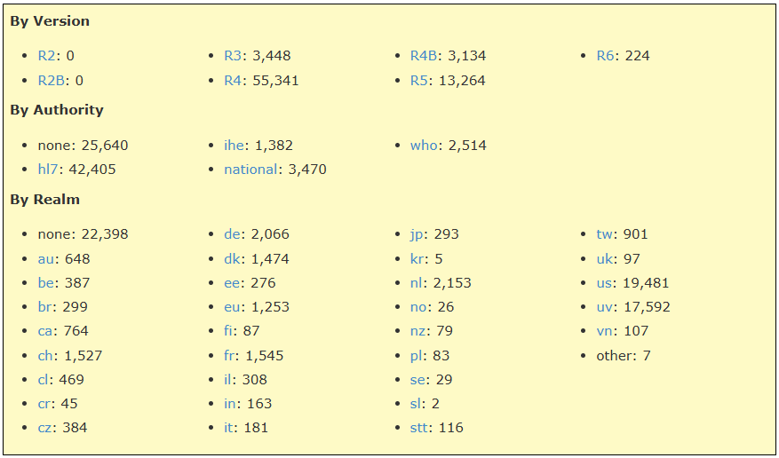

```{r setup, include=FALSE}
knitr::opts_chunk$set(echo = TRUE)
knitr::opts_chunk$set(message = FALSE)
knitr::opts_chunk$set(warning = FALSE)
knitr::opts_chunk$set(fig.align = "center")
```

```{r echo=FALSE, warning=FALSE, message=FALSE}
library(showtext)
font_add_google("Poppins", "poppins")
showtext_auto()
library(knitr)
library(rmarkdown)
library(kableExtra)
library(DT)
# Now source all other setup files AFTER fonts are initialized
source("D:/health-chain-repository/HC Data analysis/FHIR-packages-analysis/scripts_v1.1/00_setup_packages.R")
source("D:/health-chain-repository/HC Data analysis/FHIR-packages-analysis/scripts_v1.1/05_theme_healthchain.R")
theme_set(theme_healthchain())

```

# Introduction

This documentation presents a comprehensive analysis of missing data patterns in FHIR resource [**source**](https://packages2.fhir.org/xig) tables, focusing on NA co-occurrence, case-wise, and variable-wise summaries. It includes clear visualizations and actionable diagnostics to help users identify data quality issues, understand data structure, in healthcare datasets.

------------------------------------------------------------------------

# Know your Data

## Know your n's

> **Know your n's** is cruicial to understand the simple statistics of your data.

[{width="642"}](https://packages2.fhir.org/xig)

The above image is to be taken as reference while performing data manipulation.

## Load the XIG-Resources

The scraped [XIG-FHIR Resource](https://packages2.fhir.org/xig) is saved as `.json` & `.ndjson` format. The saved `xig_resource_v1.2.json` is loaded and is stored under the variable name `df`. The column names are `package = package_text`, `package_url = package_href`, `identity = identity_text`, `identity_url = identity_href`, and `title = name_title` for better readability. Later, the column headings are made to lower case and the `date` is handled with robust date parsing.

```{r warning=FALSE, message=TRUE,data_loading}
# ---- Define JSON path ----
DATA_JSON <- here("data", "raw", "xig_resource_v1.2.json")

# ---- Read JSON directly (as array) ----
df <- fromJSON(DATA_JSON, flatten = TRUE)
df <- as_tibble(df)

# ---- Initial Clean data: NA handling, column renaming, and type corrections ----
df <- df %>%
  mutate(across(everything(), ~na_if(str_trim(as.character(.)), ""))) %>%
  rename(
    package      = package_text,
    package_url  = package_href,
    identity     = identity_text,
    identity_url = identity_href,
    title        = name_title
  ) %>%
  mutate(
    version = str_to_upper(version),       # e.g., R4, R5
    date = suppressWarnings(parse_date_time(date, c("Ymd", "Ym", "Y"))), # robust date parse
    status = str_to_lower(status),
    wg     = str_to_lower(wg),
    realm  = str_to_lower(realm),
    auth   = str_to_lower(auth)
  )

```

```{r head_data}
head(df, 5)

```

## Summary

> `summary` is a generic function used to produce result summaries.

-   **Structure and Data Types**: Each variable in the FHIR dataset (such as `package`, `package_url`, `version`, `status`, etc.) is shown with its length (total records: 75,411), class (all are character except for `date`), and mode.

-   **Data Completeness**: The summary helps to quickly see which fields are fully populated and which might have missing data. For example, all core metadata (`package`, `package_url`, `version`, etc.) are character vectors of consistent length, confirming uniformity across the dataset.

-   **Special Fields**: `date` is displayed with statistics like minimum, maximum, median, and the number of missing (NA's: 10663), showing its role as a continuous or time-based field in the table.

-   **Interpretation**: This output gives an at-a-glance view of the data types, how much data is present versus missing per variable, and highlights which columns may need further attention before analysis (e.g., handling missing dates).

**In short**: This summary confirms the basic internal consistency of the resource data, highlights variable types and missingness, and provides a starting point for more in-depth data quality analysis.

```{r summary-df}
summary(df)
```

## Structure of `df`

> `str()` - Compactly display the internal structure of an R object, a diagnostic function and an alternative to `summary`.

The output shows a data frame with 75,411 rows and 13 columns, each column storing metadata about FHIR packages, such as names, URLs, version info, status, dates, and authorities. Most columns contain text data (chr), with one column (`date`) in proper date-time format, and some columns have missing values (NA). This structure provides a comprehensive registry snapshot of package identities, documentation links, and versioning details.

```{r str-df}
str(df)
```

------------------------------------------------------------------------

## More data cleaning

Factoring variables like `status`, `version`, `auth`, `wg`, and `date_raw` is crucial because it explicitly tells R to treat these columns as **categorical data**, enabling proper grouping, summarization, and modeling in subsequent analyses. If left as strings (character data), R may not recognize the underlying categories, which can lead to incorrect statistical calculations, misleading plots, and inefficient memory usage. For example, summary functions, regression models, and visualizations (e.g., bar plots) require factors to appropriately split data by distinct levels. Without factoring, functions like `table()` or `ggplot2` may not aggregate or color by group correctly, and this might accidentally allow typos or inconsistent spelling to inflate the number of apparent categories. Ultimately, converting these columns to factors ensures reliable, accurate, and reproducible analysis outcomes.

```{r as-factor}
df <- df %>%
  mutate(
    status   = as.factor(status),
    version  = as.factor(version),
    auth     = as.factor(auth),
    wg       = as.factor(wg),
    date_raw = as.factor(date_raw) # to experiment a new column called date_raw is factorised.
  )

```

As it can be seen that the variables converted as factors, show `Factor`, the levels(the categorical data) and its index values.

```{r str-df-2}
str(df)
```

And the categorical levels can be viewed again by running the `summary()` function. Check out the variables `version`, `status`, `wg`, & `auth`.

```{r summary-df-2}
summary(df)
```

## Realm and NA

From the below output see a compact version `realm` & the count of the resources.

```{r}
table(df$realm)
```

The code to generate the table summarizes the distribution of resources across different FHIR realm codes in the dataset. The most frequent realms are "us" (19,481 records), "uv" (17,592), and "nl" (2,153), while some records (22,398) lack a defined `realm`. This highlights both the dominance of certain country/region codes and the presence of a significant number of records with missing realm information.

```{r realm-count-table, layout="l-body-outset"}
realm_counts <- df %>% count(realm, sort = TRUE) %>% 
  mutate(
    realm = ifelse(is.na(realm), "NA", realm)
  )
# paged_table(realm_counts)

datatable(
  realm_counts,
  caption = "Count table by Realm",
  filter = "top",
   rownames = FALSE,
  options = list(
    pageLength = 10,
    dom = 'tip'
  )
)

```

## Versions & NA

The table summarizes the distribution of FHIR resource versions in dataset. The vast majority of records use version R4 (55,341), followed by R5 (13,264), with smaller numbers for R3, R4B, and R6. This highlights that R4 is the dominant FHIR version in your data, while adoption of other versions remains comparatively small.

```{r version-count-table, layout="l-body-outset"}
version_counts <- df %>%
  count(version = as.character(version), sort = TRUE) %>%
  mutate(version = ifelse(is.na(version), "NA", version))

datatable(
  version_counts,
  caption = "Count table by Version",
  filter = "top",
   rownames = FALSE,
  options = list(
    pageLength = 10,
    dom = 'tip'
  )
)

```

## Authority and NA

This table displays the distribution of authority values (`auth`) in the dataset. The majority of resources are attributed to "hl7" (42,405), while a significant portion (25,640) lack an explicit authority (NA). Other authorities, such as "national," "who," and "ihe," represent much smaller proportions, indicating "hl7" is the dominant assigning organization for resource metadata in this dataset.

```{r auth-count-table, layout="l-body-outset"}
auth_counts <- df %>%
  count(auth = as.character(auth), sort = TRUE) %>%
  mutate(auth = ifelse(is.na(auth), "NA", auth))

datatable(
  auth_counts,
  caption = "Count table by Authority",
  filter = "top",
   rownames = FALSE,
  options = list(
    pageLength = 10,
    dom = 'tip'
  )
)

```
## Status and NA

The table summarizes the resource status across your dataset. Most entries are either "active" (45,267) or "draft" (23,483), with smaller numbers flagged as "trial-use," "informative," "retired," or "deprecated." Rarer statuses such as "unknown," "normative," or "withdrawn" are present in very low counts, indicating that the majority of resources are either actively maintained or still under development.

```{r status-count-table, layout="l-body-outset"}
status_counts <- df %>%
  count(status = as.character(status), sort = TRUE) %>%
  mutate(status = ifelse(is.na(status), "NA", status))

datatable(
  status_counts,
  caption = "Count table by status",
  filter = "top",
   rownames = FALSE,
  options = list(
    pageLength = 10,
    dom = 'tip'
  )
)

```

## Observation
The initial overview reveals that a few key variables in the FHIR dataset have a high proportion of missing values, while most variables are largely complete. This pattern suggests targeted attention will be needed for columns like `fmm`, `wg`, and `auth` in any downstream analyses or data integration. Going forward, understanding the sources and implications of these missing values will be crucial for ensuring robust and accurate results.

------------------------------------------------------------------------

# NA Analysis

This table provides a variable-wise summary of missing data (NA values) in the dataset. For each variable, it shows both the total count of missing values (n_miss) and the percentage of missingness (pct_miss). The intent is to quickly identify which fields have substantial gaps—such as fmm and wg, which exceed 85% missingness—and which variables are nearly complete. This result is crucial for prioritizing data cleaning, imputation, or sensitivity analyses in further steps.

```{r na-count-table}

na_summary <- miss_var_summary(df)
na_summary <- as.data.frame(na_summary)
na_summary$pct_miss <- round(as.numeric(na_summary$pct_miss), 2)

datatable(
  na_summary,
  caption = "Count table by NA",
  filter = "top",
  rownames = FALSE,
  options = list(
    pageLength = 10,
    dom = 'tip'
  )
)

```
The below visualisation represent the the total count of missing values (n_miss).

```{r na-count-plot, fig.width=6, fig.height=5}
gg_miss_var(df) +
  theme_healthchain(base_size = 22) +
  labs(
    title = "NA Values present in the variables.",
    caption = "XIG/FHIR resource data"
  )

```

## Barcode summary of Missing Values in FHIR Resource Variables

This plot provides a barcode summary of missingness across all variables and rows in the dataset—each vertical stripe represents a variable, and each horizontal position indicates a record. Black marks indicate missing values, while grey represents present data. It is easy to spot which variables suffer from high proportions of missingness (e.g., `fmm`, `wg`), compared to variables with nearly complete data, giving a visual overview for prioritizing further data cleaning or imputation.

```{r na-count-map, fig.width=6, fig.height=5.5}

vis_miss(df, warn_large_data = FALSE) +
  theme_healthchain() +
  theme(
    axis.text.x = element_text(angle = 90),
    panel.grid = element_blank()  # remove grid lines
  ) +
  labs(
    title = "Missing Values in FHIR Resource Variables",
    subtitle = "Each black stripe represents a missing value for a variable in a resource row.",
    x = "Variables",
    y = "Observations (Rows)",
    caption = "Black = Missing value | Grey = Present value\nXIG/FHIR resource data"
  )


```

## Pairwise NA Co-occurrence Heatmap

```{r na-pairwise-heatmap, fig.width=7, fig.height=6}

# Build NA matrix and co-occurrence
na_matrix <- sapply(df, is.na)
pairwise_na <- crossprod(na_matrix) / nrow(df)
pairwise_long <- melt(pairwise_na, varnames = c("var1", "var2"), value.name = "na_prop")
pairwise_long <- pairwise_long %>% filter(var1 != var2)

ggplot(pairwise_long, aes(x = var1, y = var2, fill = na_prop)) +
  geom_tile(color = "grey90", size = 0.7) +
  geom_text(
    aes(label = ifelse(round(na_prop, 2) == 0, "", round(na_prop, 2))),
    color = "black", size = 5, family = "poppins"
  ) +
  scale_fill_gradient(
    low = "#0867cc", high = "#fa8801", name = "NA\nCo-occur\nProportion"
  ) +
  theme_healthchain(base_size = 16) +
  labs(
    title = "Pairwise NA Co-occurrence Heatmap",
    subtitle = "Cells show share of rows where both variables are NA",
    x = "Variable",
    y = "Variable",
    caption = "XIG/FHIR resource · Health Chain"
  ) +
  theme(
    panel.grid.major = element_line(color = "grey90", size = 0.7),
    axis.text.x = element_text(angle = 90),
    plot.caption = element_text(hjust = 1.4)
  )


```

This plot is a pairwise NA co-occurrence heatmap, visualizing the proportion of rows for which both variables have missing values.
Each cell shows the fraction (from 0 to 1) of overlaps between pairs of columns where NAs appear together, with blue indicating low co-occurrence and orange highlighting strong NA overlap. The plot reveals that variables like `fmm` and `wg` are frequently missing together, while other features are missing independently. This helps identify patterns of missingness, which is crucial for deciding on data imputation strategies and understanding possible structural issues in the dataset.

------------------------------------------------------------------------

# Conclusion

This NA analysis of the FHIR resource dataset provides both a high-level and detailed view of data completeness. The variable-wise summary table and barcode plot quickly show that several variables—including fmm, wg, auth, package_url, and realm—have extensive missingness, with over 85% of values absent for some fields. In contrast, key variables like package, version, and identity are fully complete, suggesting a reliable core for downstream analysis. The barcode plot visually confirms these patterns, allowing us to see at a glance which variables have entire rows missing and whether missingness is random or clustered.

Further, the pairwise NA co-occurrence heatmap reveals that missingness is not independent for all variables; for example, fmm and wg are often missing together, indicating a likely structural reason or related data collection process. Authority, version, and status tables indicate some structure to the data, with most resources "active", linked to "hl7" as the main authority, and supporting newer FHIR versions (R4, R5).

This comprehensive mapping of missingness highlights both opportunities and risks: while analysis is possible on the well-populated columns, substantial caution (or imputation strategies) will be needed for fields with significant gaps.

Next steps: deeper exploration of why particular variables or cases are missing, determining if missingness is "at random" or "not at random", and designing appropriate imputation approaches (or robust exclusion strategies) for downstream modeling and reporting. Additionally, understanding any workflow or system-level causes for the observed NA clustering should inform both data cleaning and future data collection improvements.
