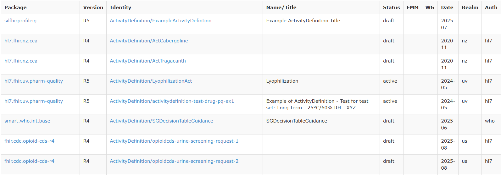

```{r setup, include=FALSE}
knitr::opts_chunk$set(echo = TRUE)
knitr::opts_chunk$set(message = FALSE)
knitr::opts_chunk$set(warning = FALSE)
knitr::opts_chunk$set(fig.align = "center")
```

```{r echo=FALSE, warning=FALSE, message=FALSE}
library(showtext)
font_add_google("Poppins", "poppins")
showtext_auto()
library(knitr)
library(rmarkdown)
library(kableExtra)
library(DT)
# Now source all other setup files AFTER fonts are initialized
source("D:/health-chain-repository/HC Data analysis/FHIR-packages-analysis/scripts_v1.1/00_setup_packages.R")
source("D:/health-chain-repository/HC Data analysis/FHIR-packages-analysis/scripts_v1.1/05_theme_healthchain.R")
theme_set(theme_healthchain())

```

# About EDA

Exploratory Data Analysis (EDA) is a process of exploring the data, often includes examining the structure and the components of the dataset, the distributions of the individual variables, and the relationship between two or more variables. The process heavily relies upon tool for EDA is visualising data using a graphical representation of the data. **Data Visualization** is arguably the most important tool for EDA because the information conveyed bby graphical display can be very quickly absorbed and because it is generally easy to recognise the patterns in a graphical display.

## Goals

### Exploring Data - Level 0

1.  What is the overall distribution of FHIR versions (R3, R4, R4B, R5, R6) in the dataset?

2.  How has the use of each FHIR version changed over time (by year or quarter of date)?

3.  Do certain authorities (auth) prefer specific versions (e.g., HL7 vs national vs WHO)?

4.  How do version choices vary by realm/country group (realm_group)?

5.  Are particular statuses (status such as active, draft, trial-use) more common for newer vs older versions?

6.  Is there any relationship between FHIR version and resource maturity (fmm) or working group (wg)?

------------------------------------------------------------------------

# Know your Data

## Know your n's

> **Know your n's** is cruicial to understand the simple statistics of your data.

[](https://packages2.fhir.org/xig)

The above image is to be taken as reference while performing data manipulation.




## Load the XIG-Resources

The scraped [XIG-FHIR Resource](https://packages2.fhir.org/xig) is saved as `.json` & `.ndjson` format. The saved `xig_resource_v1.2.json` is loaded and is stored under the variable name `df`. The column names are `package = package_text`, `package_url = package_href`, `identity = identity_text`, `identity_url = identity_href`, and `title = name_title` for better readability. Later, the column headings are made to lower case and the `date` is handled with robust date parsing.

```{r warning=FALSE, message=TRUE,data_loading}
# ---- Define JSON path ----
DATA_JSON <- here("data", "raw", "xig_resource_v1.2.json")

# ---- Read JSON directly (as array) ----
df <- fromJSON(DATA_JSON, flatten = TRUE)
df <- as_tibble(df)

# ---- Initial Clean data: NA handling, column renaming, and type corrections ----
df <- df %>%
  mutate(across(everything(), ~na_if(str_trim(as.character(.)), ""))) %>%
  rename(
    package      = package_text,
    package_url  = package_href,
    identity     = identity_text,
    identity_url = identity_href,
    title        = name_title
  ) %>%
  mutate(
    version = str_to_upper(version),       # e.g., R4, R5
    date = suppressWarnings(parse_date_time(date, c("Ymd", "Ym", "Y"))), # robust date parse
    status = str_to_lower(status),
    wg     = str_to_lower(wg),
    realm  = str_to_lower(realm),
    auth   = str_to_lower(auth)
  )

# ---- As factor conversion ----
df <- df %>%
  mutate(
    status   = as.factor(status),
    version  = as.factor(version),
    auth     = as.factor(auth),
    wg       = as.factor(wg),
    date_raw = as.factor(date_raw) # to experiment a new column called date_raw is factorised.
  )

```

## Versions & NA

The table summarizes the distribution of FHIR resource versions in dataset. The vast majority of records use version R4 (55,341), followed by R5 (13,264), with smaller numbers for R3, R4B, and R6. This highlights that R4 is the dominant FHIR version in your data, while adoption of other versions remains comparatively small.

```{r version-count-table, layout="l-body-outset"}
version_counts <- df %>%
  count(version = as.character(version), sort = TRUE) %>%
  mutate(version = ifelse(is.na(version), "NA", version))

datatable(
  version_counts,
  caption = "Count table by Version",
  filter = "top",
   rownames = FALSE,
  options = list(
    pageLength = 10,
    dom = 'tip'
  )
)

```

---

# Exploring data - Level 0

## Question 1  

> What is the overall distribution of FHIR versions (R3, R4, R4B, R5, R6) in the dataset?

```{r dist-fhir-res}

# Overall distribution of FHIR versions
version_dist <- df %>%
  count(version = as.character(version), sort = TRUE) %>%
  mutate(
    pct = round(100 * n / sum(n), 1)
  )

ggplot(version_dist, aes(x = reorder(version, -n), y = n)) +
  geom_col(fill = "#0867cc") +
  geom_text(aes(label = paste0(n, " (", pct, "%)")),
            vjust = -0.3, size = 4.6, family = "poppins") +
  labs(
    title = "Distribution of FHIR Versions in XIG Resources (2002 - 2029)",
    x = "FHIR Version",
    y = "Number of Resources",
    caption = "XIG/FHIR resource data"
  ) +
  theme_healthchain(base_size = 16) +
  theme(
    legend.position = "none"
  )


```


## Question 2  

> How has the use of each FHIR version changed over time (by year or quarter of date)?

```{r fhir-version-over-time}

# Prepare data
version_year <- df %>%
  mutate(
    date = as.Date(date),
    year = year(date)
  ) %>%
  filter(!is.na(year)) %>%
  count(year, version = as.character(version)) %>%
  group_by(year) %>%
  mutate(pct = round(100 * n / sum(n), 1)) %>%
  ungroup()

# The Plot
ggplot(version_year, aes(x = year, y = n, color = version, group = version)) +
  geom_line(linewidth = 1.3, alpha = 0.9) +
  geom_point(size = 3, alpha = 0.85) +
  scale_x_continuous(breaks = seq(min(version_year$year), max(version_year$year), by = 2)) +
  scale_y_continuous(labels = scales::comma_format()) +
  scale_color_manual(
    values = c("R3" = "#e74c3c", "R4" = "#f39c12", "R4B" = "#16a085",
               "R5" = "#2980b9", "R6" = "#8e44ad")
  ) +
  labs(
    title = "FHIR Version Adoption Over Time",
    subtitle = "Growth trajectory of each FHIR version in XIG resource publications",
    x = "Publication Year",
    y = "Number of Resources",
    color = "FHIR Version",
    caption = "XIG/FHIR resource data"
  ) +
  theme_healthchain(base_size = 16) +
  theme(
    legend.position = "right",
    panel.grid.minor = element_blank(),
    axis.text.x = element_text(angle = 90, vjust = 0.5, hjust = 1)
  )


```

This plot shows how the number of XIG resources using each FHIR version has evolved by publication year. R4 clearly dominates and exhibits an exponential growth pattern from around 2018 onward, peaking sharply in the most recent years, while R5 appears later with a smaller but noticeable rise, and R3/R4B/R6 remain marginal. The trajectories suggest that R4 has become the de facto standard in production, with R5 emerging but not yet close to R4’s scale, and earlier or transitional versions playing only minor roles over time.

## Question 3  

> Do certain authorities (auth) prefer specific versions (e.g., HL7 vs national vs WHO)?

```{r version-auth-percent}
# Summarise counts and within-author percentages
auth_version <- df %>%
  count(auth, version = as.character(version), name = "n") %>%
  group_by(auth) %>%
  mutate(
    total_auth = sum(n),
    pct = 100 * n / total_auth
  ) %>%
  ungroup()

# Color palette consistent with previous plot
version_cols <- c(
  "R3"  = "#e74c3c",
  "R4"  = "#f39c12",
  "R4B" = "#16a085",
  "R5"  = "#2980b9",
  "R6"  = "#8e44ad"
)

ggplot(auth_version, aes(x = reorder(auth, -total_auth), y = pct, fill = version)) +
  geom_col(color = "white", width = 0.75) +
  # Label only segments with pct >= 10
  geom_text(
    data = subset(auth_version, pct >= 10),
    aes(label = paste0(round(pct, 1), "%")),
    position = position_stack(vjust = 0.5),
    color = "black",
    size = 4.6,
    family = "poppins"
  ) +
  scale_y_continuous(labels = percent_format(scale = 1)) +
  scale_fill_manual(values = version_cols) +
  labs(
    title = "FHIR Version Mix by Authority",
    subtitle = "Share of each FHIR version within authority groups (auth)",
    x = "Authority",
    y = "Share of Resources (%)",
    fill = "FHIR Version",
    caption = "XIG/FHIR resource data"
  ) +
  theme_healthchain(base_size = 16) +
  theme(
    axis.text.x = element_text(angle = 45, hjust = 1)
  )

```

This stacked bar chart shows the version mix within each authority group, expressed as a percentage of that authority’s resources. HL7, national bodies, WHO, IHE, and entries with NA authority all strongly favor FHIR R4, with R4 accounting for roughly 80–97% of their resources, depending on the authority. R5 is the main secondary version, especially for HL7 and IHE, while R3, R4B, and R6 appear only as small slivers, indicating limited use. Overall, the plot shows broad convergence across authorities on R4 as the dominant implementation version, with R5 emerging but not yet widespread.

## Question 4  

> How do version choices vary by realm/country group (realm_group)?

```{r realm-version-summary}

# Realm × Version summary
realm_version <- df %>%
  count(realm, version = as.character(version), name = "n") %>%
  group_by(realm) %>%
  mutate(
    total_realm = sum(n),
    pct = 100 * n / total_realm
  ) %>%
  ungroup()

# Optional: focus on top realms by volume
top_realms <- realm_version %>%
  group_by(realm) %>%
  summarise(total = sum(n), .groups = "drop") %>%
  arrange(desc(total)) %>%
  slice_head(n = 10) %>%          # change 10 to however many you want
  pull(realm)

realm_version_top <- realm_version %>%
  filter(realm %in% top_realms)

# Consistent version colors
version_cols <- c(
  "R3"  = "#e74c3c",
  "R4"  = "#f39c12",
  "R4B" = "#16a085",
  "R5"  = "#2980b9",
  "R6"  = "#8e44ad"
)

ggplot(realm_version_top,
       aes(x = reorder(realm, -total_realm), y = pct, fill = version)) +
  geom_col(color = "white", width = 0.75) +
  geom_text(
    data = subset(realm_version_top, pct >= 10),
    aes(label = paste0(round(pct, 1), "%")),
    position = position_stack(vjust = 0.5),
    color = "black",
    size = 4.6,
    family = "poppins"
  ) +
  scale_y_continuous(labels = percent_format(scale = 1)) +
  scale_fill_manual(values = version_cols) +
  labs(
    title = "FHIR Version Mix by Realm Group",
    subtitle = "Share of each FHIR version within major realm/country groups",
    x = "Realm / Country Group",
    y = "Share of Resources (%)",
    fill = "FHIR Version",
    caption = "XIG/FHIR resource data"
  ) +
  theme_healthchain(base_size = 16) +
  theme(
    axis.text.x = element_text(angle = 45, hjust = 1)
  )

```

This chart compares the FHIR version mix within major realm or country groups, showing what share of each realm’s resources use R3, R4, R4B, R5, or R6. Most realms, including the US, EU, AU, and others, overwhelmingly favor R4, often above 90%, indicating global convergence on R4 as the default version. A few regions (like the UV test realm and NA/unspecified group) show more diversity, with non-trivial shares of R5 and occasional use of R4B or R3, suggesting experimentation or transition activity. Overall, regional differences exist at the margins, but the dominant story is broad, cross-realm standardization on FHIR R4.

Note: __"UV stands for “Universal Realm” and is used for global or realm-agnostic implementation guides intended to work across multiple countries or jurisdictions, not tied to a single national realm"__ 

So when the plot shows the `uv` realm, it is summarizing resources from universal/“global” implementation guides (like hl7.fhir.uv.ips, hl7.fhir.uv.extensions, etc.), rather than a specific country such as us, nl, or dk.

## Question 5  

>Are particular statuses (status such as active, draft, trial-use) more common for newer vs older versions?

```{r version-status-table}

# Clean version & status
df_status <- df %>%
  mutate(
    version = as.character(version),
    status  = as.character(status)
  )

# Summarise counts and within-version percentages
version_status <- df_status %>%
  count(version, status, name = "n") %>%
  group_by(version) %>%
  mutate(
    total_version = sum(n),
    pct = 100 * n / total_version
  ) %>%
  ungroup()

version_status_clean <- version_status %>%
  mutate(
    pct = round(pct, 2)   # or 1 if you prefer
  ) %>%
  rename(
    total_version = total_version  # optional, just making sure name is clear
  )

version_status_clean <- version_status %>%
  mutate(pct = round(pct, 2)) %>%
  rename(
    total = total_version   # shorter, avoids wrap
  )

DT::datatable(
  version_status_clean,
  caption = "Summary of counts and within-version percentages",
  filter = "top",
  rownames = FALSE,
  options = list(
    pageLength = 5,
    dom = 'tip',
    autoWidth = TRUE,
    columnDefs = list(
      list(width = '70px', targets = 0),   # version
      list(width = '90px', targets = 1),   # status
      list(width = '70px', targets = 2:4)  # n, total, pct
    )
  )
)


```


```{r version-status-plot, fig.width=10}

version_status <- df %>%
  mutate(
    version = as.character(version),
    status  = as.character(status)
  ) %>%
  count(version, status, name = "n") %>%
  group_by(version) %>%
  mutate(
    total = sum(n),
    pct   = 100 * n / total
  ) %>%
  ungroup()


library(glue)

# Get min–max years actually present in df
year_range <- df %>%
  mutate(year = year(as.Date(date))) %>%
  filter(!is.na(year)) %>%
  summarise(
    min_year = min(year),
    max_year = max(year)
  )

year_min <- year_range$min_year
year_max <- year_range$max_year
subtitle_text <- glue(
  "Share of active, draft, trial-use and other statuses by version ({year_min}–{year_max})"
)

ggplot(version_status,
       aes(x = reorder(status, pct), y = pct, fill = status)) +
  geom_col(width = 0.7) +
  geom_text(
    aes(label = paste0(round(pct, 1), "%")),
    hjust = -0.1,
    size = 4.6,
    family = "poppins"
  ) +
  facet_wrap(~ version, nrow = 1) +
  scale_y_continuous(
    labels = scales::percent_format(scale = 1),
    expand = expansion(mult = c(0, 0.25))
  ) +
  coord_flip() +
  labs(
    title = "Status Profile Within Each FHIR Version",
    subtitle = subtitle_text,
    x = "Status",
    y = "Share of Resources (%)",
    fill = "Status",
    caption = "XIG/FHIR resource data"
  ) +
  theme_healthchain(base_size = 16) +
  theme(
    axis.text.y = element_text( hjust = 1),
    axis.text.x = element_text( size = 0),
    legend.position = "none",
    panel.grid.major = element_blank(),
    panel.grid.minor = element_blank(),
    panel.spacing.x = unit(1.2, "lines")   # more space between facet panels
  )

```

---

# Exploring data - Level 1

## Question 6

> Within FHIR version R4, how many packages are published each year, and how does the status mix (active, draft, trial-use, etc.) change over time?

```{r Year_wise_pkg_cnt_R4, fig.width= 10}
# Year-wise FHIR package counts for R4, coloured by status
r4_year_status <- df %>%
  mutate(
    date    = as.Date(date),
    year    = year(date),
    version = as.character(version),
    status  = as.character(status)
  ) %>%
  filter(!is.na(year), version == "R4") %>%
  count(year, status, name = "n") %>%
  arrange(year, status)

status_cols <- c(
  "active"      = "#ff6b6b",  # adjust to exact Health Chain palette
  "deprecated"  = "#c97b36",
  "draft"       = "#f3c969",
  "informative" = "#16a085",
  "normative"   = "#123358",
  "retired"     = "#8e44ad",
  "trial-use"   = "#e056fd",
  "unknown"     = "#95a5a6"
)

ggplot(r4_year_status,
       aes(x = year, y = n, fill = status)) +
  geom_col(width = 0.8,
           colour = "white",        # white borders between stacks
           linewidth = 0.3) +       # thin border
  geom_vline(xintercept = 2019,
             linetype = "dashed",
             colour = "#123358",
             linewidth = 0.7) +
  annotate("text",
           x = 2019,
           y = max(r4_year_status$n, na.rm = TRUE) * 1.02,
           label = "FHIR R4 official release (2019)",
           angle = 90,
           hjust = 0.5,
           vjust = -0.35,
           family = "poppins",
           size = 6) +
  scale_fill_manual(values = status_cols) +
  scale_x_continuous(
    breaks = seq(min(r4_year_status$year), max(r4_year_status$year), by = 1)
  ) +
  scale_y_continuous(labels = comma_format()) +
  labs(
    title = "Year-wise R4 FHIR Package Counts by Status",
    subtitle = "Stacked counts of R4 packages by publication year and status\nDashed line marks official R4 publication in 2019",
    x = "Publication Year",
    y = "Number of R4 Packages",
    fill = "Status",
    caption = "XIG/FHIR resource data"
  ) +
  theme_healthchain(base_size = 16) +
  theme(
    legend.position = "right",
    panel.grid.minor = element_blank(),
    axis.text.x = element_text(angle = 90, vjust = 0.5, hjust = 1)
  )

```

This plot shows that R4 usage is almost negligible before 2018, then climbs steeply after the standard’s official 2019 release, with active packages driving most of the growth. A noticeable anomaly is the presence of a few R4 packages well before 2019, which likely reflects early trial or backfilled content that has been cataloged as R4 in XIG even though the release was not yet normative. The sharp expansion of draft, informative, normative, retired, and trial‑use segments in the 2020–2025 window suggests not only new guides, but also many existing artifacts moving through successive status stages over multiple publication years. Because XIG snapshots each published package version, the same logical guide can be counted in several years with different statuses, which helps explain why later years show both a much larger total bar height and a richer mix of non‑active statuses.

> Focusing next on unique packages (not every published snapshot) will give a cleaner picture of how many distinct R4 implementations exist and when they first appear.

## Question 7

> Among FHIR R4 packages, how many unique packages exist by first publication year, and how does their status mix (active, draft, trial-use, etc.) look for those first appearances?

```{r uniq_R4_pkg_status, fig.width=10}

# 1) Identify each unique R4 package and its first-seen year + status
r4_unique_first <- df %>%
  mutate(
    date    = as.Date(date),
    year    = year(date),
    version = as.character(version),
    status  = as.character(status)
  ) %>%
  filter(!is.na(year), version == "R4") %>%
  group_by(package) %>%                 # or package_name / canonical
  arrange(date, .by_group = TRUE) %>%
  slice(1) %>%                             # keep first appearance of each package
  ungroup()

# 2) Summarise unique-package counts by first year and status
r4_unique_year_status <- r4_unique_first %>%
  count(year, status, name = "n") %>%
  arrange(year, status)

# 3) Plot: first-appearance counts of unique R4 packages by year and status
status_cols <- c(
  "active"      = "#ff6b6b",
  "deprecated"  = "#c97b36",
  "draft"       = "#f3c969",
  "informative" = "#16a085",
  "normative"   = "#123358",
  "retired"     = "#8e44ad",
  "trial-use"   = "#e056fd",
  "unknown"     = "#95a5a6"
)

ggplot(r4_unique_year_status,
       aes(x = year, y = n, fill = status)) +
  geom_col(width = 0.8, colour = "white", linewidth = 0.3) +
  geom_vline(xintercept = 2019,
             linetype = "dashed",
             colour = "#123358",
             linewidth = 0.7) +
  annotate("text",
           x = 2019,
           y = max(r4_unique_year_status$n, na.rm = TRUE) * 1.02,
           label = "FHIR R4 official release (2019)",
           angle = 90,
           hjust = 0.2,
           vjust = -0.35,
           family = "poppins",
           size = 5) +
  scale_fill_manual(values = status_cols) +
  scale_x_continuous(
    breaks = seq(min(r4_unique_year_status$year),
                 max(r4_unique_year_status$year),
                 by = 1)
  ) +
  scale_y_continuous(labels = comma_format()) +
  labs(
    title = "First Appearance of Unique R4 FHIR Packages by Status",
    subtitle = "Each bar counts distinct R4 packages in the year they first appear in XIG,\ncoloured by status at first publication; dashed line marks official R4 release in 2019",
    x = "First Publication Year (R4)",
    y = "Number of Unique R4 Packages",
    fill = "Status at First Appearance",
    caption = "XIG/FHIR resource data"
  ) +
  theme_healthchain(base_size = 16) +
  theme(
    legend.position = "right",
    panel.grid.minor = element_blank(),
    axis.text.x = element_text(angle = 90, vjust = 0.5, hjust = 1)
  )

```

This chart counts each distinct R4 package once, in the year it first appears in XIG, and colors bars by the status at that first publication. Very few unique R4 packages appear before 2016, and only a trickle arrive in the years immediately around the official 2019 release, indicating that early R4 adoption was limited to a small set of early guides. From 2019 onward, the number of new R4 packages per year grows sharply, with 2021–2025 showing sustained high inflow, dominated by packages that debut as draft or active, and a smaller but visible stream entering directly as informative, normative, or trial-use. The presence of pre‑2019 R4 packages and a few “unknown” statuses suggests that some guides were effectively R4-aligned before formal publication or that historical metadata in XIG is incomplete, but the main story is a strong and accelerating pipeline of new, R4-based implementation guides since R4 became the normative baseline.

## Question 8

> Who are the ‘early adopters’ of FHIR R4 before its official 2019 release, and what do their packages look like in terms of authority, realm, and status at first appearance (≤ 2018)?

```{r early-adopters-plot, fig.width=11, fig.height=9}

# 1) Unique R4 packages with first-seen year
r4_unique_first <- df %>%
  mutate(
    date    = as.Date(date),
    year    = year(date),
    version = as.character(version),
    status  = as.character(status)
  ) %>%
  filter(!is.na(year), version == "R4") %>%
  group_by(package) %>%          # or package_name/canonical
  arrange(date, .by_group = TRUE) %>%
  slice(1) %>%                      # first appearance of each package
  ungroup()

# 2) Restrict to pre‑2019 "early R4" packages
r4_early <- r4_unique_first %>%
  filter(year < 2019)

# Quick summaries to answer the question
early_by_year <- r4_early %>%
  count(year, name = "n_packages")

early_by_auth <- r4_early %>%
  count(auth, name = "n_packages") %>%
  arrange(desc(n_packages))

early_by_realm <- r4_early %>%
  count(realm, name = "n_packages") %>%
  arrange(desc(n_packages))

early_by_status <- r4_early %>%
  count(status, name = "n_packages") %>%
  arrange(desc(n_packages))

# early_by_year
# early_by_auth
# early_by_realm
# early_by_status

# Reshape to long "dimension" form
r4_early_long <- bind_rows(
  r4_early %>% transmute(dimension = "Year",        key = factor(year),        package),
  r4_early %>% transmute(dimension = "Authority",   key = factor(auth),        package),
  r4_early %>% transmute(dimension = "Realm group", key = factor(realm), package),
  r4_early %>% transmute(dimension = "Status",      key = factor(status),      package)
)

r4_early_sum <- r4_early_long %>%
  count(dimension, key, name = "n_packages")

# Example dark-ish palette per facet dimension
dim_cols <- c(
  "Authority"   = "#f26d21",  # orange
  "Realm group" = "#7bb446",  # green
  "Status"      = "#00bcd4",  # teal
  "Year"        = "#b455e0"   # purple
)

ggplot(r4_early_sum,
       aes(x = key, y = n_packages, fill = dimension)) +
  geom_col(colour = "white", linewidth = 0.4) +
  geom_text(
    aes(label = n_packages),
    vjust = -0.25,
    size = 5.2,
    family = "poppins"
  ) +
  facet_wrap(~ dimension, scales = "free_x", ncol = 2) +
  scale_fill_manual(values = dim_cols) +
  scale_y_continuous(
    labels = comma_format(),
    expand = expansion(mult = c(0, 0.2))
  ) +
  labs(
    title = "Early (Pre 2019) Unique R4 Packages Across Dimensions",
    subtitle = "Each panel counts distinct R4 packages first seen before 2019\nby year, authority, realm group, and status at first appearance",
    x = NULL,
    y = "Number of Unique R4 Packages",
    fill = NULL,
    caption = "XIG/FHIR resource data"
  ) +
  theme_healthchain(base_size = 18) +
  theme(
    legend.position   = "none",
    panel.grid.minor  = element_blank(),
    axis.text.x       = element_text(angle = 60, hjust = 1, size = 16),
    axis.text.y       = element_text(size = 0),
    strip.text        = element_text(size = 22, face = "bold", family = "poppins"),
    plot.title        = element_text(size = 22, face = "bold"),
    plot.subtitle     = element_text(size = 20, lineheight = 0.9),
    plot.caption      = element_text(size = 16)
  )

```

This view shows that pre‑2019 R4 “early adopter” packages are concentrated in a small set of authorities, led by HL7 and a sizable NA/unspecified group, with only a handful from IHE, national bodies, or WHO. Realm-wise, most early R4 packages are tagged as universal (uv), US, or NA, reinforcing the idea that R4 experimentation started in global or North American contexts rather than being broadly distributed across country realms. In terms of status at first appearance, nearly all early R4 packages debut as active or draft, with only a few starting as informative, normative, or trial-use, which suggests early implementers were pushing “real” guides rather than purely experimental ballots. The year panel shows a very thin trickle before 2012, followed by a gradual rise and then a sharp jump in 2018, confirming that most early R4 activity clusters in the immediate run-up to the official 2019 release.


**Conclusion**: The main inference is that R4 did not appear “out of nowhere” in 2019; there was a concentrated early‑adopter phase dominated by HL7 and US/UV/NA realms in the years just before the official release. These early R4 packages mostly launched as active or draft, indicating that organizations were already publishing production‑oriented or near‑production guides, not just experimental ballots, well ahead of R4’s normative milestone. Because the pre‑2019 cohort is relatively small and highly concentrated by authority and realm, you can reasonably characterize them as a focused vanguard of implementers that helped stabilize and prove out R4 before it became the global default.

## Question 9

> How do lifecycle trajectories differ for early (pre‑2019) R4 packages versus later (2019+) R4 packages in terms of how their statuses evolve over time?

```{r r4_a}

# 1) All R4 snapshots with year
r4_all <- df %>%
  mutate(
    date    = as.Date(date),
    year    = year(date),
    version = as.character(version),
    status  = as.character(status)
  ) %>%
  filter(!is.na(year), version == "R4")

# 2) First year per package to classify cohort
r4_first <- r4_all %>%
  group_by(package) %>%
  summarise(first_year = min(year, na.rm = TRUE), .groups = "drop") %>%
  mutate(cohort = if_else(first_year < 2019, "early (pre 2019)", "late (2019+)"))

# 3) Attach cohort and find *latest* status per package
r4_latest <- r4_all %>%
  left_join(r4_first, by = "package") %>%
  group_by(package) %>%
  arrange(date, .by_group = TRUE) %>%
  slice_tail(n = 1) %>%              # last snapshot
  ungroup()

# 4) Summarise: final status by cohort
r4_final_status <- r4_latest %>%
  count(cohort, status, name = "n") %>%
  group_by(cohort) %>%
  mutate(pct = round(100 * n / sum(n), 1)) %>%
  ungroup()

# Count unique R4 packages per cohort
cohort_counts <- r4_latest %>%
  count(cohort, name = "n_packages")

status_cols <- c(
  "active"      = "#ff6b6b",
  "deprecated"  = "#c97b36",
  "draft"       = "#f3c969",
  "informative" = "#16a085",
  "normative"   = "#123358",
  "retired"     = "#8e44ad",
  "trial-use"   = "#e056fd",
  "unknown"     = "#95a5a6"
)

ggplot(r4_final_status,
       aes(x = cohort, y = pct, fill = status)) +
  geom_col(colour = "white", linewidth = 0.3) +
  geom_text(
    aes(label = ifelse(pct >= 5, paste0(pct, "%"), "")),
    position = position_stack(vjust = 0.5),
    family = "poppins",
    size = 5
  ) +
  scale_fill_manual(values = status_cols) +
  scale_y_continuous(
    labels = percent_format(scale = 1),
    expand = expansion(mult = c(0, 0.02))
  ) +
  labs(
    title = "Final Status of Unique R4 Packages by Cohort",
    subtitle = "Each bar shows the status mix of unique R4 packages based on their latest snapshot in XIG\nearly (pre 2019): 81 packages · late (2019+): 540 packages",
    x = "R4 Cohort (by first appearance)",
    y = "Share of Unique R4 Packages (final status)",
    fill = "Final Status",
    caption = "XIG/FHIR resource data"
  ) + theme_healthchain(base_size = 16) +
  theme(
    legend.position = "right",
    panel.grid.minor = element_blank(),
    axis.text.x = element_text(
      vjust = 1,
      margin = margin(b = 6)   # pushes labels up a bit
    ),
    axis.title.x = element_text(
      margin = margin(t = 12)  # adds extra space above the title
    )
  )


```

This chart compares the final status mix of unique R4 packages for early (pre‑2019) adopters versus those that first appeared from 2019 onward. Both cohorts end up with roughly half of packages in active status, indicating that early guides are just as likely as later ones to remain live in the ecosystem. However, early packages have a noticeably larger share ending as trial‑use (about 15–16%) compared with late packages (around 8%), consistent with early adopters doing more experimentation and piloting. Late‑cohort packages lean more heavily toward draft as a final state and show a smaller trial‑use footprint, suggesting that many newer guides are still maturing through the pipeline rather than having fully cycled through trial and retirement decisions.

## Question 10

> How did the resource-type mix of content evolve from early (pre‑2019) R4 packages to later (2019+) packages—for example, were early packages skewed toward conformance/terminology resources while later packages added more clinical and workflow resources?

```{r}

r4_all_res <- df %>%
  mutate(
    date    = as.Date(date),
    year    = year(date),
    version = as.character(version),
    identity = as.character(identity)
  ) %>%
  filter(version == "R4", !is.na(package), !is.na(identity)) %>%
  mutate(
    resource_type = sub("/.*", "", identity)
  )

# package-level cohort
r4_pkg_first <- r4_all_res %>%
  group_by(package) %>%
  summarise(first_year = min(year, na.rm = TRUE), .groups = "drop") %>%
  mutate(cohort = if_else(first_year < 2019, "early (pre 2019)", "late (2019+)"))

r4_res_with_cohort <- r4_all_res %>%
  left_join(r4_pkg_first, by = "package")

# distinct resources
res_type_counts <- r4_res_with_cohort %>%
  distinct(cohort, resource_type, package, identity) %>%
  count(cohort, resource_type, name = "n_resources")

# pick top 8 resource types overall
top_types <- res_type_counts %>%
  group_by(resource_type) %>%
  summarise(total = sum(n_resources), .groups = "drop") %>%
  arrange(desc(total)) %>%
  slice_head(n = 8) %>%
  pull(resource_type)

res_top <- res_type_counts %>%
  filter(resource_type %in% top_types) %>%
  mutate(
    cohort = factor(cohort, levels = c("early (pre 2019)", "late (2019+)")),
    resource_type = fct_reorder2(resource_type, cohort, n_resources)
  )

ggplot(res_top,
       aes(x = resource_type, y = n_resources, fill = cohort)) +
  geom_col(position = "dodge", colour = "white", linewidth = 0.3) +
  geom_text(
    aes(label = n_resources),
    position = position_dodge(width = 0.9),
    vjust = -0.15,
    family = "poppins",
    size = 4.2
  ) +
  scale_y_continuous(labels = comma_format(),
                     expand = expansion(mult = c(0, 0.15))) +
  scale_fill_manual(values = c(
    "early (pre 2019)" = "#ff6b6b",
    "late (2019+)"     = "#2980b9"
  )) +
  labs(
    title = "Top R4 Resource Types in Early vs Late Packages",
    subtitle = "Counts of distinct R4 resources (package + identity) for the eight most common resource types,\nsplit into early (pre 2019) and late (2019+) package cohorts",
    x = "Resource type",
    y = "Number of Unique R4 Resources",
    fill = "R4 Cohort",
    caption = "XIG/FHIR resource data"
  ) +
  theme_healthchain(base_size = 16) +
  theme(
    legend.position  = "top",
    panel.grid.minor = element_blank(),
    axis.text.x      = element_text(angle = 45, hjust = 1),
    legend.title = element_text(colour = "black", face = "italic"),
    legend.text  = element_text(),  # base
    # make each label match its key colour
    legend.key.size = unit(0.9, "lines"),
    plot.margin  = margin(t = 20, r = 25, b = 10, l = 20)
  )

```

The chart shows that both early and late R4 packages are overwhelmingly built on StructureDefinition and ValueSet resources, but late packages contribute far more of both, reflecting the overall growth and profiling intensity of the ecosystem. For code-level semantics, late packages also dominate CodeSystem and SearchParameter counts, suggesting that more recent implementation guides are doing heavier terminology curation and custom search tuning than the early cohort. For “orchestration” and higher-level logic, late packages again outnumber early ones in ConceptMap, CapabilityStatement, ImplementationGuide, and Questionnaire resources, indicating that later R4 work not only scaled breadth but pushed further into workflow, capability declaration, and questionnaire-driven use cases built on top of the earlier profiling foundations.

---

# Conclusion

The document starts by defining a clean XIG resource dataset: JSON is read, key fields are renamed, strings are trimmed to NA, versions and statuses are normalised, and core columns (status, version, auth, wg, date_raw) are factorised for analysis. It then profiles overall FHIR version usage, showing that R4 dominates XIG resources by count and percentage, with smaller but non‑trivial volumes of R3, R4B, R5, and emerging R6 content. A time‑series of version counts by publication year reveals that each version has its own adoption curve, with R4 showing a steep rise leading up to and following its 2019 publication, while older versions plateau or decline.​

Next, the analysis looks at which authorities publish which versions, using stacked percentage bars: HL7 and a few other major authorities carry most of the volume, and within each authority R4 is usually the largest share, but the mix of R3, R4B, R5, and R6 varies by publisher. A similar realm‑by‑version view focuses on the top realms and shows that US, universal (uv), and NA groups heavily favour R4 but also host a growing proportion of R5+ content, while some national realms remain more conservative. Status profiles by version indicate that resources are mostly active or draft, with trial‑use and informative making up smaller slices and clear but limited use of retired/deprecated states; interestingly, newer versions still have a large draft share, reflecting work in progress.​

The report then narrows to R4 packages, first plotting year‑wise counts by status and marking the official 2019 R4 release, showing a long low‑level tail of pre‑2019 activity and a strong post‑2019 ramp‑up. Distinguishing unique R4 packages by their first appearance year and status confirms that a modest number of early (pre‑2019) guides existed before the release, mostly active or draft, and that 2018 is a clear inflection point just ahead of the official milestone. A faceted bar chart of early R4 packages by authority, realm group, status, and year shows that these early adopters are concentrated in HL7 and US/UV/NA realms, with early content skewed toward active/draft statuses and clustered in the immediate pre‑2019 years.​

Lifecycle analysis classifies packages into early vs late cohorts based on first R4 year and compares their final statuses at the latest snapshot; both cohorts end up with roughly half their packages active, but early packages have a higher share of trial‑use, consistent with heavier piloting among pioneers. Finally, resource‑level analysis parses the FHIR resource type from each identity and compares counts of distinct resources in early and late R4 packages, showing that StructureDefinition and ValueSet dominate both cohorts, with late packages contributing far more resources across these and other key types like CodeSystem, SearchParameter, ConceptMap, CapabilityStatement, ImplementationGuide, and Questionnaire. Together, these questions, plots, and answers build a consistent narrative: R4 grew out of a focused early‑adopter phase into a broad, authority‑ and realm‑spanning ecosystem, deepening not just in package count but in the volume and diversity of concrete resources it defines.

---

